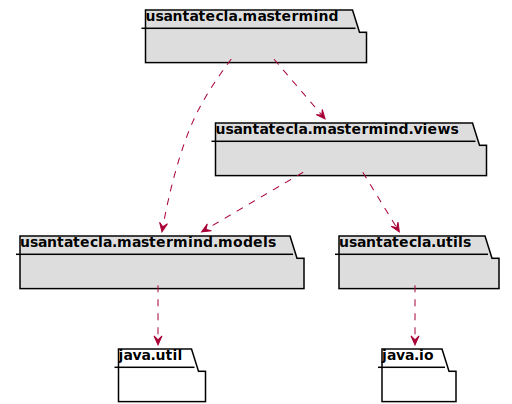
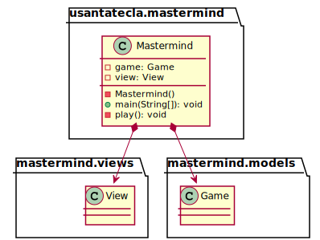
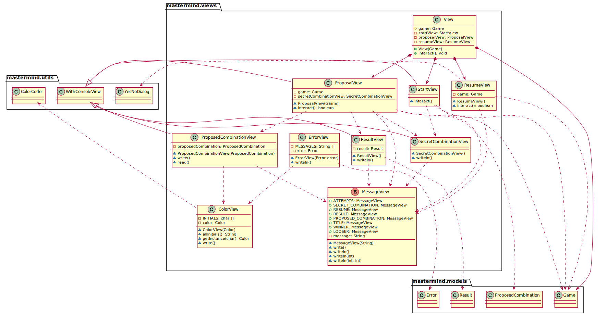
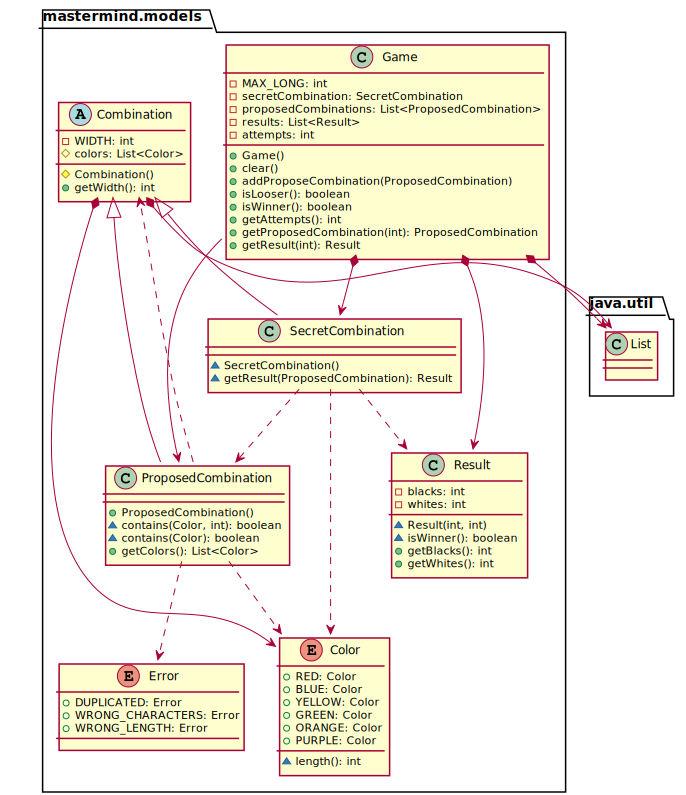
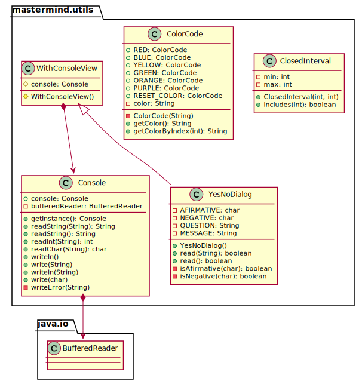
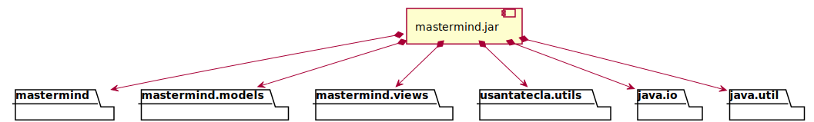
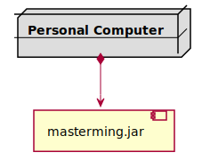

## Master Mind. Solucion 2.1. documentView
Santa Tecla  
parqueNaturalSantaTecla@gmail.com  
version 0.0.1  
Índice  
1. [Requisitos 1. Básica](#requisitos-1-básica)  
2. [Vista de Lógica/Diseño](#vista-de-lógicadiseño)  
2.1. [Arquitectura](#arquitectura)  
2.2. [Paquete mastermind](#paquete-mastermind)  
2.3. [Paquete mastermind.views](#paquete-mastermindviews)  
2.4. [Paquete mastermind.models](#paquete-mastermindmodels)  
2.5. [Paquete mastermind.utils](#paquete-mastermindutils)  
3. [Calidad del Software](#calidad-del-software)  
3.1. [Diseño](#diseño)  
3.2. [Rediseño](#rediseño)  
4. [Vista de Desarrollo/Implementación](#vista-de-desarrolloimplementación)
5. [Vista de Despliegue/Física](#vista-de-desplieguefísica)
6. [Vista de Procesos](#vista-de-procesos)

# Requisitos 1. Básica

| [Wiki](https://en.wikipedia.org/wiki/Mastermind_(board_game)) - [Youtube](https://www.youtube.com/watch?v=2-hTeg2M6GQ)   * _Funcionalidad: **Básica**_   * _Interfaz: **Texto**_   * _Distribución: **Standalone**_   * _Persistencia: **No**_  |  |  
| :------- | :------: |

# Vista de Lógica/Diseño
  - Arquitectura Documento/Vista mediante **Patrón de Vista Separada**

## Arquitectura

## Paquete *mastermind*

## Paquete *mastermind.views*

## Paquete *mastermind.models*

## Paquete *mastermind.utils*

# Calidad del Software

## Diseño

  - ***Método largo**: Método "play" de Mastermind,…​*

## Rediseño

  - *Nueva interfaz: Gráfica*
    
      - ***Clases Grandes**: los Modelos asumen la responsabilidad y
        crecen en líneas, métodos, atributos, …​ con cada nueva
        tecnología*
    
      - ***Alto acoplamiento**: los Modelos con cada nueva tecnología de
        interfaz (consola, gráficos, web, …​)*
    
      - ***Baja cohesión**: cada Modelo está gestionando sus atributos y
        las tecnologías de interfaz*
    
      - ***Open/Close**: hay que modificar los modelos que estaban
        funcionando previamente para escoger una tecnología de vista u
        otra (if’s anidados)*

  - *Nuevas funcionalidades: undo/redo, demo, estadísiticas,…​*
    
      - ***Clases Grandes**: los Modelos asumen la responsabilidad y
        crecen en líneas, métodos, atributos, …​ con las nuevas
        funcionalidades*
    
      - ***Open/Close**: hay que modificar los modelos que estaban
        funcionando previamente para incorporar nuevas funcionalidades*

# Vista de Desarrollo/Implementación

# Vista de Despliegue/Física

# Vista de Procesos
  - No hay concurrencia
